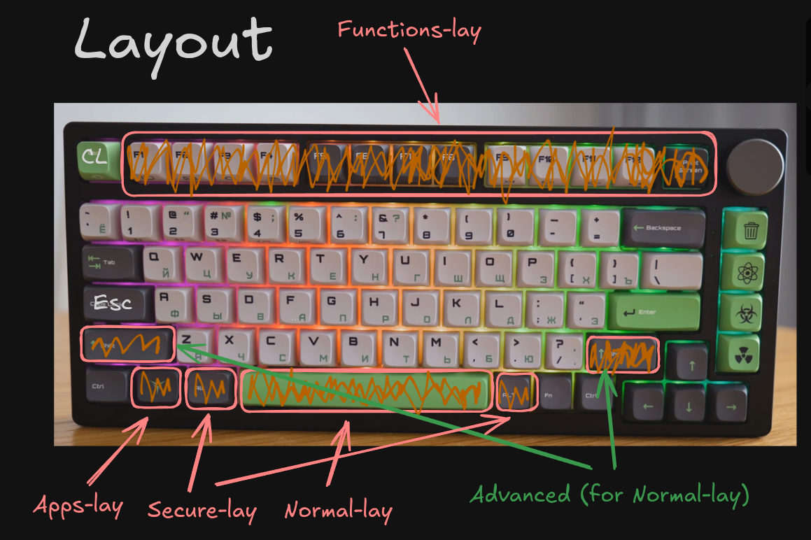

### 🚀 Features

- All actions with the system are tied to the keyboard
    - Minimalism (GUI)
    - Quick & Fast

### 💻 Usage

- `Shift + Caps` - change lang
- `Caps` - Esc (useful for vim)

- `Super (Win) + ...` - [Apps-lay](docs/assets/layouts/Apps-lay.png)
- `Alt + ...` - [Secure-lay](docs/assets/layouts/Secure-lay.png)
- `Space + ...` - [Normal-lay](docs/assets/layouts/Normal-lay.png)
- `[Shift] + F{1-12}` - [Functions-lay](docs/assets/layouts/Functions-lay.png)